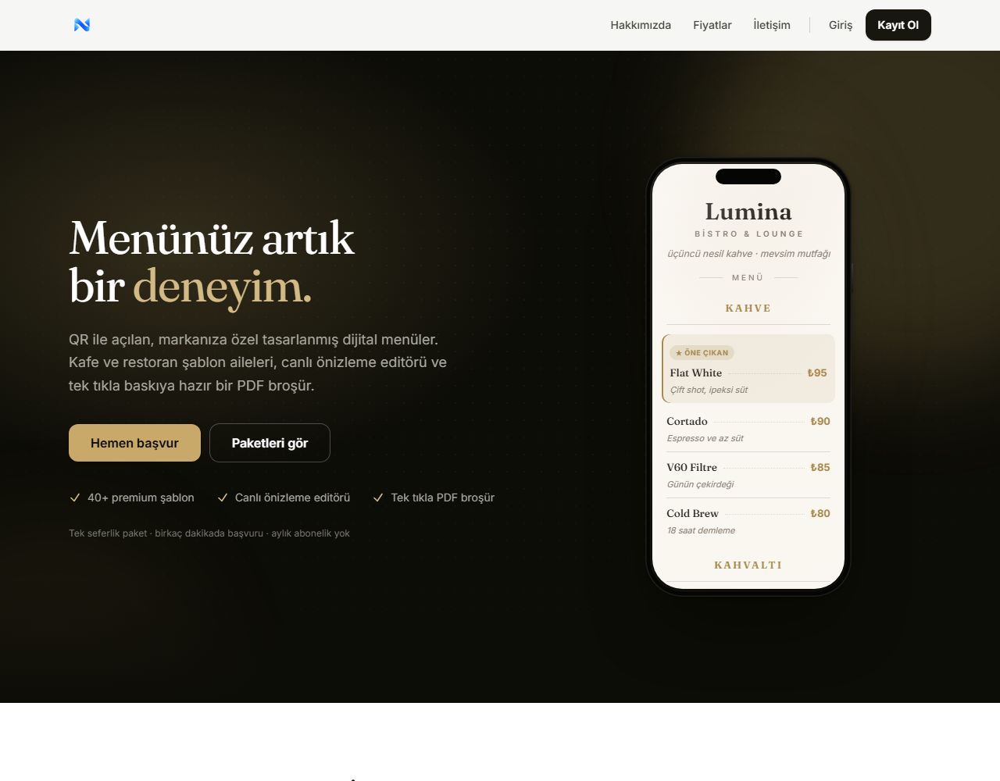
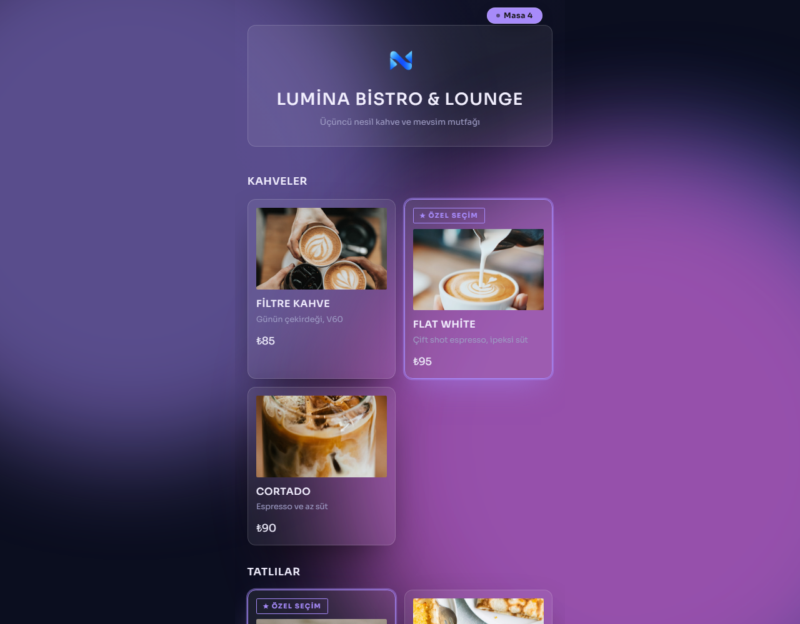
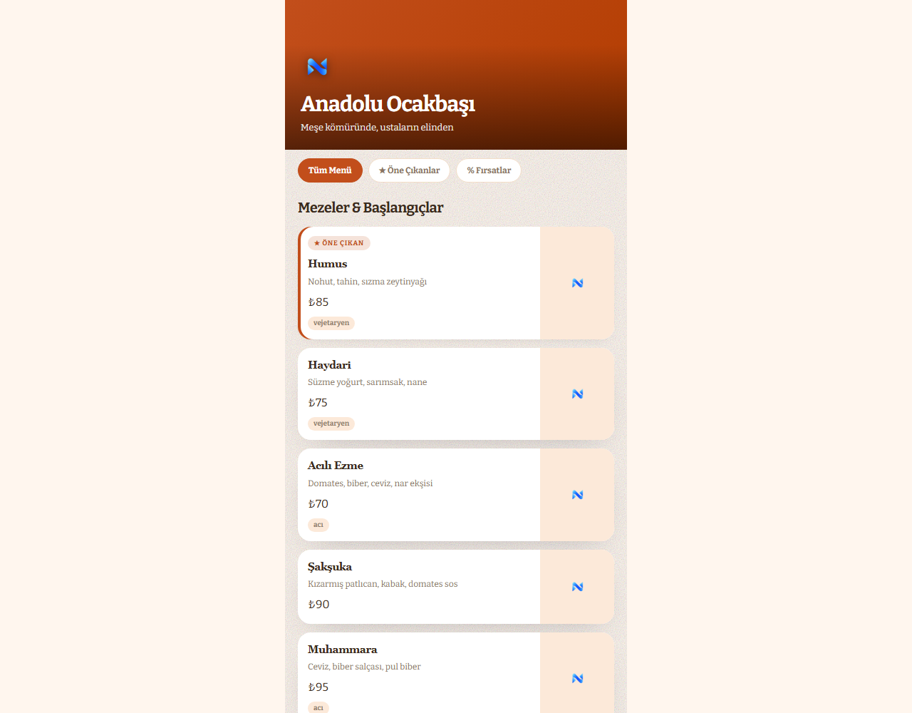

<div align="center">

# ✨ Neva-QR Menü

**Lüks, çok kiracılı (multi-tenant) SaaS QR menü platformu.**
Her işletme kendi alt domaininde yayınlanır → `lumina.nevaqr.com`

[](https://laravel.com)
[](https://php.net)
[](https://tailwindcss.com)
[](https://alpinejs.dev)




</div>

---

## 🎯 Ne yapar?

| | |
|---|---|
| 🏪 **Kendi alt domaini** | İşletme panelden ad ister → admin onaylar → DNS + otomatik doğrulama → menü **anında canlı**. |
| 🎨 **40 ayrı şablon** | Renk varyantı değil: her şablonun kendi Blade iskeleti + kendi CSS'i var. Telefon maketinde canlı önizleme. |
| 📱 **QR + PDF** | Masa başına QR PNG (10 QR tasarımı) ve şablona uyarlı, görselli lüks menü PDF'i. |
| 📊 **Tarama analitiği** | Gün + masa bazlı görüntülenme sayacı — IP/cihaz kimliği saklamadan. |
| 💳 **Havale ile satış** | Kartlı ödeme yok: referans kodlu havale/EFT + admin onayı. Paket bazlı yetki matrisi sunucu tarafında zorlanır. |
| 💬 **Destek mesajlaşması** | Panel ↔ admin chatbox, okunmamış rozetleri, e-posta bildirimleri. |

---

## 📸 Ekran görüntüleri

| Canlı menü — *Glassmorphism Luxury* | Canlı menü — *Sunset Orange* |
|---|---|
|  |  |
| QR'daki `?masa=4` sağ üstte rozete dönüşür. | Aynı veri, tamamen farklı iskelet ve tipografi. |

---

## 🧠 Mimari — bir isteğin yolculuğu

```mermaid
flowchart LR
    QR([📱 QR okutuldu]) --> DNS{{lumina.nevaqr.com}}
    DNS --> RT[ResolveTenant<br/>tek indeksli sorgu]
    RT --> C{menu_version<br/>önbelleği}
    C -- isabet --> H[/HTML/]
    C -- ıska --> R[Şablon render] --> H
    H --> B[/olcum beacon/] --> V[(menu_visits<br/>gün + masa)]
    H --> M[/gorsel/... ] --> D[(özel disk)]
```

Üç tasarım kararı her şeyi belirliyor:

1. **Önbellek `menu_version` ile anahtarlanır.** Panelde bir değişiklik olunca sürüm artar,
   anahtar değişir, menü **anında** tazelenir. TTL (2 saat) yalnızca üst sınırdır.
2. **Ölçüm istemciden yapılır.** Sayfa önbellekten geldiği için sunucu render'ı çoğu istekte
   çalışmaz; sayaç `/olcum` beacon'ı ile artar ve gün + masa bazında toplanır.
3. **Görseller özel diskte durur.** `/gorsel/{yol}` ucu yetki kontrolü yapar: yayında olmayan
   bir işletmenin fotoğrafları sahibi ve admin dışında kimseye açılmaz.

> Ayrıntılı "neden böyle" notları: [`.claude/memory/`](.claude/memory/MEMORY.md)

---

## 🚀 Hızlı başlangıç

```bash
composer install && npm install
cp .env.example .env && php artisan key:generate
touch database/database.sqlite && php artisan migrate --seed
npm run build
php artisan serve --host=127.0.0.1 --port=8000
```

Menüler `{isletme}.{NEVA_ROOT_DOMAIN}` adresinde açılır — yerelde `NEVA_ROOT_DOMAIN=localhost`
ile `http://lumina.localhost:8000` çalışır (`*.localhost` çoğu tarayıcıda 127.0.0.1'e çözülür).

Tam kurulum, üretim ayarları ve sürüm yükseltme adımları: **[KURULUM.md](KURULUM.md)**

### Demo hesaplar (seed sonrası)

| Rol | E-posta | Şifre |
|-----|---------|-------|
| Platform admini | `admin@neva-qr.com` | `password` |
| İşletme sahibi (kahve) | `sahip@neva-qr.com` | `password` |
| İşletme sahibi (ocakbaşı) | `ocakbasi@neva-qr.com` | `password` |

### Sık kullanılan komutlar

| Komut | Ne yapar |
|-------|----------|
| `php artisan test --exclude-group=slow` | Hızlı takım (70 test, ~6 sn) |
| `php artisan test` | 40 şablonun PDF'i dahil tam takım (82 test, ~8 dk) |
| `php artisan neva:warm-menus` | Canlı menü önbelleğini ısıtır (2 saatte bir cron) |
| `php artisan neva:health-check` | Yayındaki alt domainler gerçekten açılıyor mu (saatlik) |
| `php artisan neva:uploads-tasi` | Eski `/storage` yüklemelerini özel diske taşır (tek seferlik) |
| `php artisan neva:onkontrol` | Yayın öncesi tam denetim (alt domain · üretim · SEO) |
| `php artisan neva:yedek` | Veritabanı + görseller + `.env` tek arşive (günlük cron) |
| `php artisan neva:admin-olustur` | İlk platform yöneticisini açar (üretimde ZORUNLU ilk adım) |
| `php artisan cache:clear` | Menü HTML önbelleğini boşaltır |

---

## 🖥️ Ekranlar

| Alan | Yol |
|------|-----|
| Pazarlama | `/` · `/qr-menu-sablonlari` · `/qr-menu-sablonlari/{şablon}` · `/fiyatlandirma` · `/sikca-sorulan-sorular` · `/hakkimizda` · `/iletisim` |
| Kimlik | `/login` · `/register` · `/forgot-password` |
| Sahip paneli | `/panel` · `/panel/isletme` · `/panel/tasarim` · `/panel/kategoriler` · `/panel/urunler` · `/panel/istatistik` · `/panel/qr` · `/panel/mesajlar` |
| Admin | `/admin` · `/admin/talepler` · `/admin/uyelik-talepleri` · `/admin/mesajlar` |
| Canlı menü | `http://{subdomain}.{kök alan}` · masa QR: `/m/{token}` · ölçüm: `/olcum` · görsel: `/gorsel/{yol}` |

---

## 🎨 Şablon sistemi

**40 mimari olarak ayrı şablon** — her birinin kendi Blade iskeleti
(`resources/views/templates/skeletons/*.blade.php`) ve kendi CSS bloğu var.

<details>
<summary><b>40 şablonun listesi</b></summary>

**1–20:** Minimalist Kaffe · Dark Prestige · Neon Street · Botanical Green · Classic Bistro ·
Modern Grid · Sunset Orange · Royal Blue · Compact Fast · Artisan Crafted · Glassmorphism Luxury ·
Neo Brutalism · Minimal Mono · Cyber Dark · Golden Hour · Retro Diner · Alpine Clean ·
Sunset Vibes · Urban Chic · Velvet Noir

**21–30 (görsel odaklı):** Culinary Bento · Cinematic Dark · Magazine Grid · Stories Style ·
Polaroid Vibe · Floating Image · Split Card · Glass Hero · Grid Showcase · Gourmet Masonry

**31–40:** Heritage Press · Coastal Breeze · Carbon Mono · Onyx Lux · Saffron Table ·
Atelier Soft · Riso Pop · Linen Note · Prime Steakhouse · Kyoto Calm

Galeri sınıflandırması (`template_focus`): 23 görsel odaklı + 17 tipografik = 40.
Bir şablon sınıflandırmada eksik veya çift kayıtlıysa `DesignController` 500 fırlatır.
</details>

- **Özellik bayrakları** (`config/neva.php`): `family` (list/rich/grid/classic/compact), `cover`,
  `animation`, `layout_type`, `mood`, `hide_desc`, `locks`. `TemplatePresenter` bunları `data-*`
  olarak yayar; `supports($control)` ile panel dinamik çalışır.
- **Gelişmiş Dokunuşlar — şablona özel:** 3 renk seçici, arka plan dokusu, 16 giriş animasyonu,
  görsel stili, köşe yuvarlaklığı, başlık kalınlığı, yazı boyutu. Hepsi
  `restaurants.template_settings` altında **şablon bazında** saklanır; desteklenmeyen kontrol
  panelde tamamen gizlenir ve backend'de yok sayılır.
- **Akıllı görsel fallback:** ürün fotoğrafı → işletme logosu → saf tipografik kart.
- **Öne çıkan & indirimli ürünler her şablonda farklı görünür:** lüks şablonlarda altın hâle,
  grid ailesinde en üste sıralama + köşe rozeti, brutal şablonlarda kart zemini değişir,
  minimalistlerde rozet yerine tipografik kontrast.

---

## 🔒 Güvenlik & gizlilik

- **Düz metin şifre yok.** Hesap açılınca kullanıcıya tek kullanımlık "şifre belirle" bağlantısı gider.
- **CSP / HSTS / nosniff / Referrer-Policy** tüm web yanıtlarında (`SecurityHeaders`).
- **Hız sınırları:** kayıt, iletişim, alt domain sorgusu, QR/PDF üretimi, önizleme, mesaj, ölçüm.
- **Yayın kolonları kütle atamaya kapalı** (`subdomain`, `status`, `published_at` … yalnız servis katmanından).
- **Kiracı izolasyonu sorgu seviyesinde:** kategori/ürün her zaman kiracının kendi ilişkisi üzerinden aranır.
- **Görsel izolasyonu:** özel disk + yetkili servis ucu + yol beyaz listesi (dizin çıkışı engelli).
- **Analitikte kişisel veri yok:** IP, konum, cihaz kimliği saklanmaz; yalnızca gün + masa sayacı.
- `audit_logs` tablosu kritik admin işlemlerini kaydeder.

---

## 🗂️ Dizin yapısı

```
├── app/
│   ├── Console/Commands/    # onkontrol · yedek · warm-menus · health-check · veri-temizle
│   ├── Http/
│   │   ├── Controllers/
│   │   │   ├── Panel/       # tasarım, kategori, ürün, QR, PDF, istatistik, mesaj
│   │   │   ├── Admin/       # alt domain kuyruğu, üyelik talepleri, mesajlar
│   │   │   ├── Tenant/      # canlı menü + ölçüm ucu
│   │   │   └── MediaController.php   # /gorsel/{yol} — yetkili görsel servisi
│   │   └── Middleware/      # ResolveTenant · SecurityHeaders · EnsurePlanFeature …
│   ├── Models/              # Restaurant, Category, Product, Plan, Subscription,
│   │                        # SubdomainRequest, RestaurantTable, MenuVisit, …
│   ├── Services/            # QrService, MenuPdfService, SubdomainService,
│   │                        # VisitTracker, PlanGate, DnsProvisioner, MessagingService
│   └── Support/             # TemplatePresenter, MenuSchema, ShowcaseMenu, ShowcaseCopy
├── config/neva.php          # marka, kök alan, şablon kataloğu, paket yetki matrisi
├── deploy/                  # kurulum.sh · guncelle.sh · nginx/nevaqr.conf
├── docs/                    # URETIM · SEO · GUVENLIK · PERFORMANS
├── resources/views/templates/skeletons/   # 40 şablon iskeleti
├── resources/views/marketing/showcase/    # 40 şablonun vitrin sayfaları
├── resources/views/errors/  # markalı 404/403/419/429/500/503
├── routes/{web,tenant}.php  # ana domain · alt domain
└── tests/Feature/           # 82 test
```

### Migrationlar

| Dosya | Tablo | Amaç |
|-------|-------|------|
| `0001_01_01_000000_create_users_table` | `users`, `sessions` | Kimlik + `role` (owner/admin) |
| `2026_08_30_000100_create_restaurants_table` | `restaurants` | **Kiracı:** `subdomain`, `template`, `status`, marka |
| `2026_08_30_000200/300` | `categories`, `products` | Menü içeriği, sıralama, etiket & alerjen (JSON) |
| `2026_08_30_000400` | `plans`, `subscriptions` | Paketler + abonelik |
| `2026_08_30_000500` | `subdomain_requests` | Admin onay kuyruğu |
| `2026_08_30_000600` | `restaurant_tables` | Masalar + tekil `qr_token` |
| `2026_09_01_000200` | `restaurants` | `menu_version` + yayın izleri (publish_status, verified_at …) |
| `2026_09_01_000300/400` | `conversations`, `messages`, `contact_messages` | Mesajlaşma |
| `2026_09_01_000600` | `audit_logs` | Denetim kaydı |
| `2026_09_02_000100` | `menu_visits` | Gün + masa bazlı görüntülenme sayacı |
| `2026_09_02_000200` | `restaurants` | Silinen kaydın alt domainini serbest bırakır |

---

## 🧭 Kullanıcı akışı

1. Kayıt → havale bilgileri + referans kodu → admin ödemeyi işaretler → hesap açılır.
2. Panelde işletme profili, şablon seçimi, kategori/ürün girişi (sürükle-bırak sıralama).
3. Alt domain adı istenir → anlık müsaitlik kontrolü → `subdomain_requests` kuyruğuna düşer.
4. Masa QR'ları ve menü PDF'i indirilir.
5. **"Onaya Gönder"** → admin onaylar → DNS + otomatik doğrulama → menü **canlı**.
6. İstatistik ekranında taramalar birikir.

---

## 🗺️ Yol haritası

- [x] **Altyapı** — migrationlar, modeller, wildcard rota + tenant middleware, seed
- [x] **Auth + Panel** — elle kurulan kimlik doğrulama, CRUD, canlı önizleme
- [x] **QR + PDF** — masa QR'ları (10 tasarım), şablona uyarlı görselli PDF
- [x] **Onay akışı** — talep → admin onayı → DNS → otomatik doğrulama → yayın
- [x] **40 şablon** + şablona özel gelişmiş dokunuşlar
- [x] **Güvenlik sertleştirme** — şifre politikası, CSP, hız sınırları, denetim kaydı
- [x] **Havale ödeme akışı** + paket yetki matrisi
- [x] **Mesajlaşma** (panel ↔ admin) ve e-posta bildirimleri
- [x] **Menü önbelleği** — `menu_version` + TTL + ısıtma cron'u
- [x] **Tarama analitiği** — `/olcum` beacon + İstatistik ekranı
- [x] **Sürükle-bırak sıralama** — kategoriler + ürünler (kütüphanesiz, dokunmatik uyumlu)
- [x] **Dosya izolasyonu** — özel disk + `/gorsel` yetkili servis + silmede temizlik
- [x] **Alt domain iadesi** — silinen kaydın etiketi serbest kalır
- [x] **SEO altyapısı** — 40 şablon vitrin sayfası, FAQ + FAQPage schema, bağlı JSON-LD
      varlık grafiği (`Organization`/`WebSite`/`SoftwareApplication`), sitemap, `neva:onkontrol --seo`
- [x] **Markalı hata sayfaları** — 404/403/419/429/500/503, Türkçe ve dış bağımlılıksız
- [ ] **SEO içerik** — blog/rehber modülü, şehir + mutfak bazlı landing sayfaları
      (bkz. [docs/SEO.md](docs/SEO.md) §3)
- [x] **Dağıtım altyapısı** — Ubuntu 24.04 kurulum + dağıtım betikleri, wildcard nginx bloğu
- [x] **Yedekleme** — `neva:yedek` (DB + görseller + `.env`), günlük, 14 gün saklama
- [x] **Güvenlik denetimi** — uçtan uca inceleme, [docs/GUVENLIK.md](docs/GUVENLIK.md)
- [ ] **Per-şablon CSS bölme** — şu an 40 şablonun CSS'i tek bundle'da → LCP
- [ ] **Müşterinin kendi alan adı** — `custom_domain` + Cloudflare for SaaS
- [ ] **KVKK** — aydınlatma metni, çerez izni, veri saklama politikası
- [ ] **Online ödeme** (iyzico) — hacim büyüyünce
- [ ] **Çoklu dil**

---

<div align="center">

**Neva-QR Menü** · özel depo (private) · tüm hakları saklıdır

</div>
